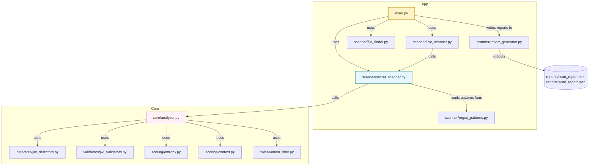

# Dependency Graph — API Key Leakage Scanner

This file contains a visual dependency graph (Mermaid) of the main Python modules in the project. Open this file in VS Code and use Markdown preview to render the diagram.

Plain-text adjacency (for quick copy):
- `main.py` -> `scanner/live_scanner.py`, `scanner/file_finder.py`, `scanner/secret_scanner.py`, `scanner/report_generator.py`
- `scanner/live_scanner.py` -> `scanner/secret_scanner.py`
- `scanner/secret_scanner.py` -> `scanner/regex_patterns.py`, `core/analyzer.py`, `filters/vendor_filter.py`
- `core/analyzer.py` -> `detectors/jwt_detectors.py`, `validators/jwt_validators.py`, `scoring/entropy.py`, `scoring/context.py`, `filters/vendor_filter.py`

Rendering tips:
- In VS Code: open `dependency_graph.md` and press `Ctrl+Shift+V` or use the Markdown preview to render the Mermaid diagram.
- Alternative: convert Mermaid to PNG/SVG with Mermaid CLI if installed.

If you want, I can also generate a DOT file or render a PNG here (if you want me to install tools and run rendering).